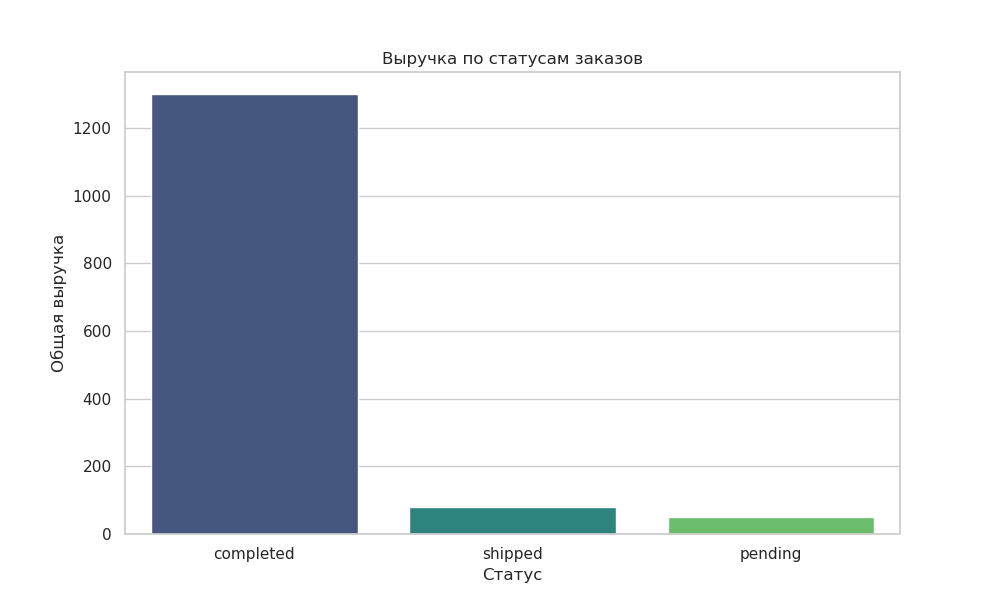

# Spark Data Pipeline Example



## 📊 Ноутбук


Простой ETL-пайплайн на PySpark с визуализацией.

## Этапы
1. Чтение CSV
2. Очистка данных
3. Агрегация: средняя зарплата по отделам
4. Визуализация

## Как запустить

### 1. ETL (PowerShell)
```powershell
docker run -it --rm `
  -v "${PWD}:/work" `
  --entrypoint="" `
  apache/spark `
  /opt/spark/bin/spark-submit `
  /work/src/diagnose_json.py

